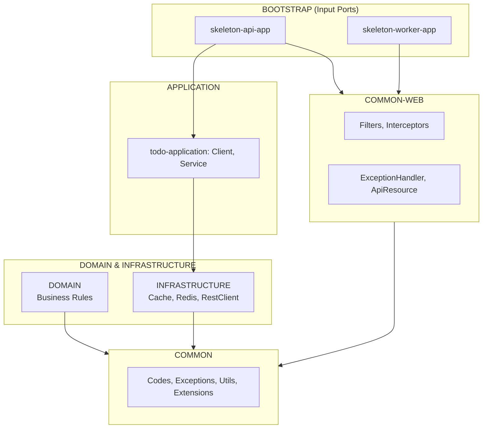
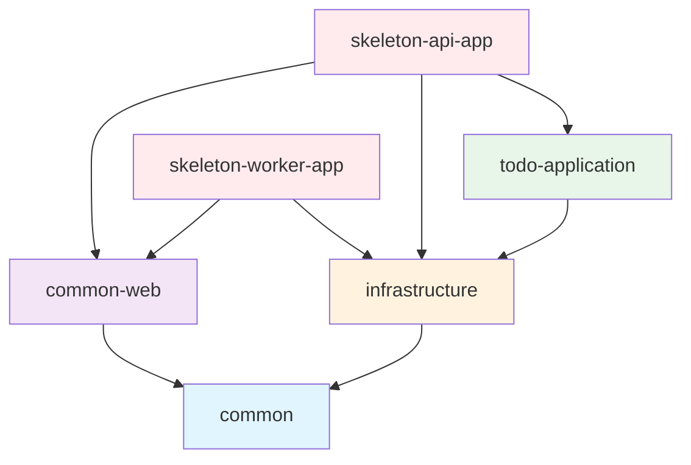

# Project Modules & Architecture

## Hexagonal Architecture

이 프로젝트는 Hexagonal Architecture (Ports & Adapters) 패턴을 따릅니다.



## Module Structure

```
modules/
├── common/                     # 공통 유틸리티, 예외, 코드
├── common-web/                 # 웹 공통 (Filter, Interceptor, Handler)
├── domain/                     # 도메인 모델, 비즈니스 규칙
├── application/                # 애플리케이션 서비스
│   └── todo-application/       # Todo 애플리케이션 (Client, Service)
├── infrastructure/             # DB, Cache, HTTP Client, 외부 서비스
└── bootstrap/                  # Spring Boot 앱 모듈
    ├── skeleton-api-app/       # API 서버
    └── skeleton-worker-app/    # Worker 서버
```

## Module Dependencies



### Dependency Direction Rule

* 상위 레이어 → 하위 레이어 방향으로만 의존
* common은 최하위 모듈 (다른 모듈에 의존하지 않음)
* `-app` 모듈은 다른 모듈을 조합하는 역할

## Modules

### common

공통 유틸리티 모듈. 다른 모든 모듈의 기반.

| Package | Purpose |
|---------|---------|
| `codes/` | ResponseCode, ErrorCode, SuccessCode |
| `exceptions/` | BizException, BizRuntimeException, KnownException |
| `utils/datetime/` | DateFormatter, LocalDateRange, SearchDates |
| `utils/extensions/` | String 마스킹, DateTime 확장 |
| `utils/cipher/` | AES, SEED 암호화 |

### common-web

웹 공통 인프라 모듈.

| Package | Purpose |
|---------|---------|
| `filters/` | AppTraceFilter (UUID v7), ContentCachingFilter |
| `interceptors/` | LogInterceptor, LogResponseBodyInterceptor |
| `handlers/` | GlobalExceptionHandlerV2 |
| `response/` | ApiResource, Status, Meta, PageResponse |
| `aop/` | LogTraceAspect, CheckIpAspect |

### application

애플리케이션 서비스 계층. 비즈니스 로직 오케스트레이션.

#### todo-application

| Package | Purpose |
|---------|---------|
| `client/` | TodoClient (@HttpExchange), TodoClientConfig |
| `client/dto/` | External API DTOs |
| `service/` | TodoService, Todo (domain model) |

### infrastructure

기술 구현 모듈. Driven/Output Adapters.

| Package | Purpose |
|---------|---------|
| `client/` | RestClientConfig, HttpLoggingInterceptor |
| `cache/` | CacheConfig (Caffeine + Redis) |
| `redis/` | RedisLockAspect, RedisCacheAspect |
| `persistence/` | JPA Repositories, Entities |

### bootstrap

Spring Boot Application 모듈.

| Module | Purpose |
|--------|---------|
| `skeleton-api-app` | REST API 서버 (Controllers) |
| `skeleton-worker-app` | Worker 서버 (Scheduled Jobs) |

## Module Naming Convention

* `-app` suffix: Spring Boot executable (bootJar 활성화)
* No suffix: Library module (jar only)

## Package Naming Convention

```
io.glory.{modulename}/
├── api/                # Controllers (bootstrap only)
├── client/             # HTTP Client interfaces
├── config/             # Configuration classes
├── dto/                # Data Transfer Objects
├── entity/             # JPA Entities
├── repository/         # Repositories
└── service/            # Application services
```

## Creating New Module

### Application Module

```
modules/application/my-application/
├── build.gradle.kts
└── src/main/kotlin/io/glory/myapplication/
    ├── client/
    │   ├── MyClient.kt           # @HttpExchange interface
    │   ├── MyClientConfig.kt     # Client configuration
    │   └── dto/
    │       └── MyDto.kt
    └── service/
        ├── MyService.kt          # Application service
        └── MyDomain.kt           # Domain model
```

### Bootstrap App Module

```
modules/bootstrap/my-api-app/
├── build.gradle.kts
└── src/main/kotlin/io/glory/myapiapp/
    ├── api/
    │   └── MyController.kt
    ├── config/
    │   └── AppConfig.kt
    └── MyApiApplication.kt
```

## HTTP Client Pattern

### @HttpExchange 사용

```kotlin
@HttpExchange("/todos")
interface TodoClient {
    @GetExchange
    fun findAll(): List<TodoDto>

    @GetExchange("/{id}")
    fun findById(@PathVariable id: Int): TodoDto

    @PostExchange
    fun create(@RequestBody todo: TodoDto): TodoDto
}
```

### Client Configuration

```kotlin
@Configuration
@ImportHttpServices(group = "mygroup", types = [TodoClient::class])
class TodoClientConfig {

    @Bean
    fun todoClientGroupConfigurer(): RestClientHttpServiceGroupConfigurer {
        return RestClientHttpServiceGroupConfigurer { groups ->
            groups.filterByName("mygroup")
                .forEachClient { _, builder ->
                    builder.baseUrl("https://api.example.com")
                        .requestInterceptor(HttpLoggingInterceptor("TodoClient"))
                }
        }
    }
}
```

## Response Format

모든 API 응답은 `ApiResource<T>` 형식을 따릅니다.

```kotlin
@GetMapping("/{id}")
fun findById(@PathVariable id: Int): ApiResource<Todo> {
    return ApiResource.success(todoService.findById(id))
}
```

응답 구조:

```json
{
  "status": {
    "status": 200,
    "code": "SUCCESS",
    "message": "Operation successful"
  },
  "meta": {
    "size": 1
  },
  "data": { ... }
}
```

## Exception Handling

### Exception Types

| Exception | Usage | Log Level |
|-----------|-------|-----------|
| `KnownException` | 예상된 에러 (validation, not found) | INFO |
| `BizRuntimeException` | 비즈니스 에러 (처리 불가) | ERROR |
| `BizException` | Checked 비즈니스 예외 | ERROR |

### Custom Exception

```kotlin
class TodoNotFoundException(id: Int) : KnownException(
    ErrorCode.DATA_NOT_FOUND,
    "Todo not found: $id"
)
```

## Caching Strategy

### Two-tier Cache

| Layer | Configuration |
|-------|---------------|
| L1 (Caffeine) | Local memory, 200 items, 30min TTL |
| L2 (Redis) | Distributed, configurable TTL |

### Cache Names

| Name | TTL | MaxIdle | Usage |
|------|-----|---------|-------|
| SHORT_LIVED | 10min | 5min | Search, realtime data |
| DEFAULT | 30min | 10min | General queries |
| MID_LIVED | 1hour | 20min | Infrequently changed data |
| LONG_LIVED | 24hour | 4hour | Code tables, settings |
