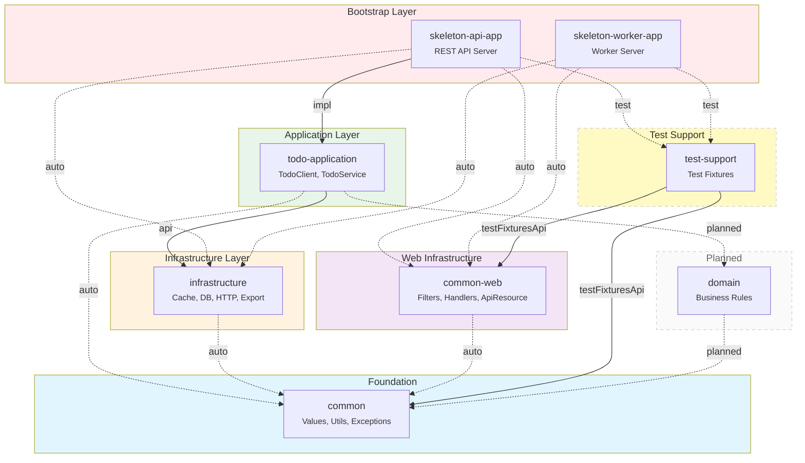
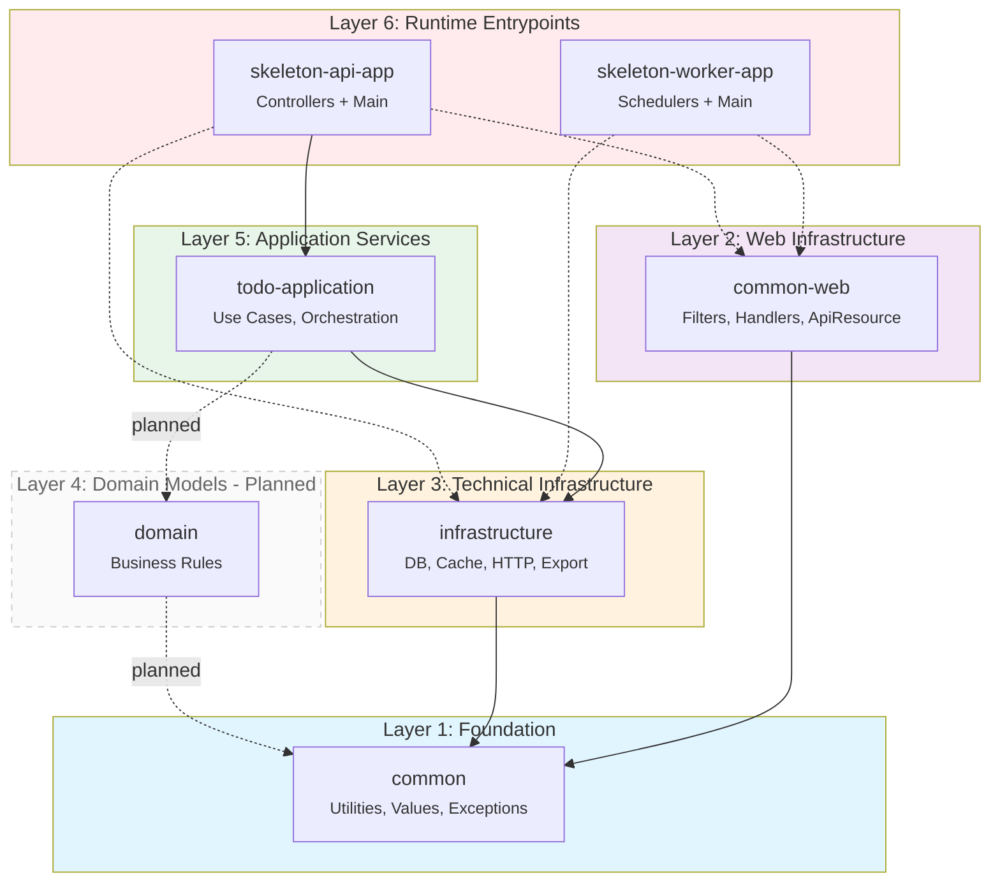
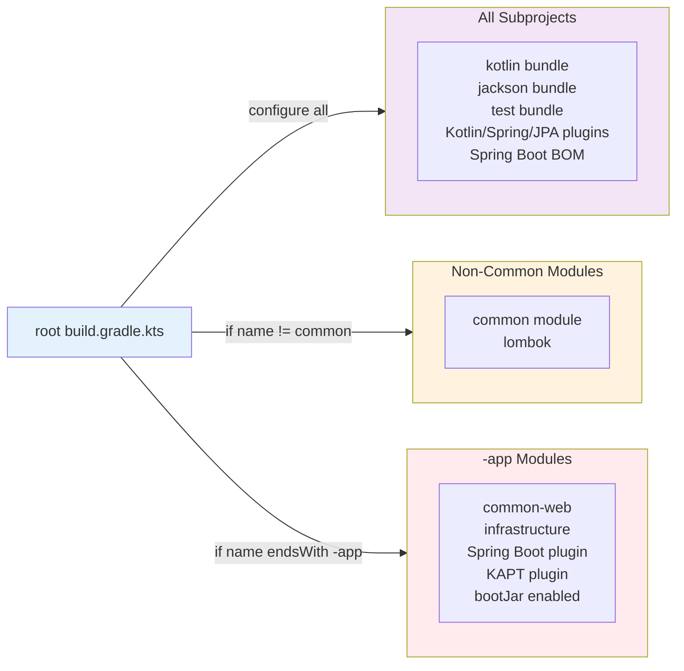

# Module Dependencies

## Overview

This project implements a pragmatic hexagonal architecture combining Layered Architecture with Ports & Adapters patterns. Dependencies flow unidirectionally from outer layers (bootstrap/runtime) toward inner layers (foundation/domain), with automatic dependency injection configured at the root build script level.

## Module Inventory

| Module | Type | Package Root | Purpose |
|--------|------|--------------|---------|
| `common` | Foundation | `io.glory.common` | Core utilities, value objects (Email, Money, Rate), exceptions, date/time handling |
| `common-web` | Web Infrastructure | `io.glory.commonweb` | Filters, interceptors, exception handlers, ApiResource response format |
| `test-support` | Test Fixtures | - | Shared test fixtures library (`java-test-fixtures` plugin) |
| `infrastructure` | Technical | `io.glory.infrastructure` | Cache (Caffeine, Redisson), DB (JPA, QueryDSL), HTTP clients, POI, Slack |
| `todo-application` | Application | `io.glory.todoapplication` | Reference application: TodoClient, TodoService |
| `skeleton-api-app` | Bootstrap (app) | `io.glory.skeletonapiapp` | REST API server (Spring Boot executable) |
| `skeleton-worker-app` | Bootstrap (app) | `io.glory.skeletonworkerapp` | Worker/scheduler server (Spring Boot executable) |
| `domain` _(planned)_ | Domain | `io.glory.domain` | Pure business rules and domain models |

## Architecture Diagrams

### Complete Module Dependency Graph



### Layered Architecture View



### Dependency Injection Flow



## Dependency Rules

### Rule 1: Zero External Dependencies for Foundation
**Evidence**: `common` module has zero project dependencies, only external libraries (`libphonenumber`).

### Rule 2: Unidirectional Dependency Flow
**Evidence**: Dependencies flow from runtime (`*-app`) → application → infrastructure → foundation. No reverse dependencies exist.

### Rule 3: Auto-Injection for Common Modules
**Evidence**: Root build script automatically injects `common` to all non-common modules, `common-web` + `infrastructure` to all `-app` modules.

### Rule 4: Test-Only Dependencies Isolated
**Evidence**: `test-support` module uses `testFixturesApi` scope, consumed only via `testImplementation(testFixtures())`.

### Rule 5: Bootstrap Modules Are Leaves
**Evidence**: No module depends on `*-app` modules; they are terminal runtime nodes.

### Rule 6: Domain Independence (Planned)
**Evidence**: Future `domain` module will depend only on `common`, ensuring domain isolation.

## Auto-Injection Summary

| Target Scope | Injected Dependencies | Applied To |
|--------------|----------------------|------------|
| All subprojects | `kotlin`, `jackson`, `test` bundles | Every module |
| Non-common modules | `common` module + lombok | All except `common` |
| `-app` modules | `common-web` + `infrastructure` + Spring Boot + KAPT | `skeleton-api-app`, `skeleton-worker-app` |

## Quick Reference

### Dependency Direction (Top → Bottom)

```
skeleton-api-app / skeleton-worker-app    ← Bootstrap (executables)
    ├── todo-application                  ← Application services
    │       └── infrastructure            ← Technical implementations
    │               └── common            ← Foundation
    ├── common-web ──────────┘            ← Web infrastructure
    │       └── common
    └── test-support (test only)          ← Test fixtures
            ├── common
            └── common-web
```

### Module Import Guidelines

- **common**: Import for value objects (Email, Money, Rate), exceptions, utilities
- **common-web**: Import for ApiResource, filters, interceptors, exception handlers
- **infrastructure**: Import for cache, DB, HTTP clients, technical integrations
- **test-support**: Import via `testImplementation(testFixtures())` for test fixtures
- **Bootstrap apps**: Never import these in other modules

### Test Dependencies

```
*-app modules → testFixtures(test-support) → common + common-web
```
